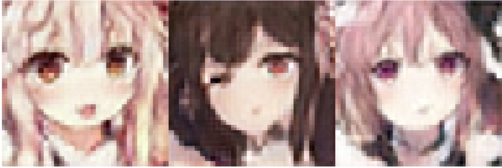

# anime-face-generator
CSC420 Project: Generate Waifu Faces

# Description
This project generates new female anime faces.

# File Navigation

## StyleGAN_fromScratch.ipynb

Trains StyleGAN neural network from scratch using full body and face dataset. Results stored in notebook are only face. Full body results are available in `results/from-scratch-fullbody` and `results/from-scratch-face`

## superUNet.py

Super sampler neural network based on Unet

## supersample.ipynb

Super sampler using `image-super-resolution` (source: https://github.com/idealo/image-super-resolution)

## transfer_learning.ipynb

Transfer learning for StyleGAN to generate anime faces

## results

image results during training from models. Files in the directory are from transfer learning and images generated when using a model trained from scratch are under `from-scratch-face` and `from-scratch-fullbody`

## test_image.png

Example result from our neural network

# Time Lapse of Training

# Result

